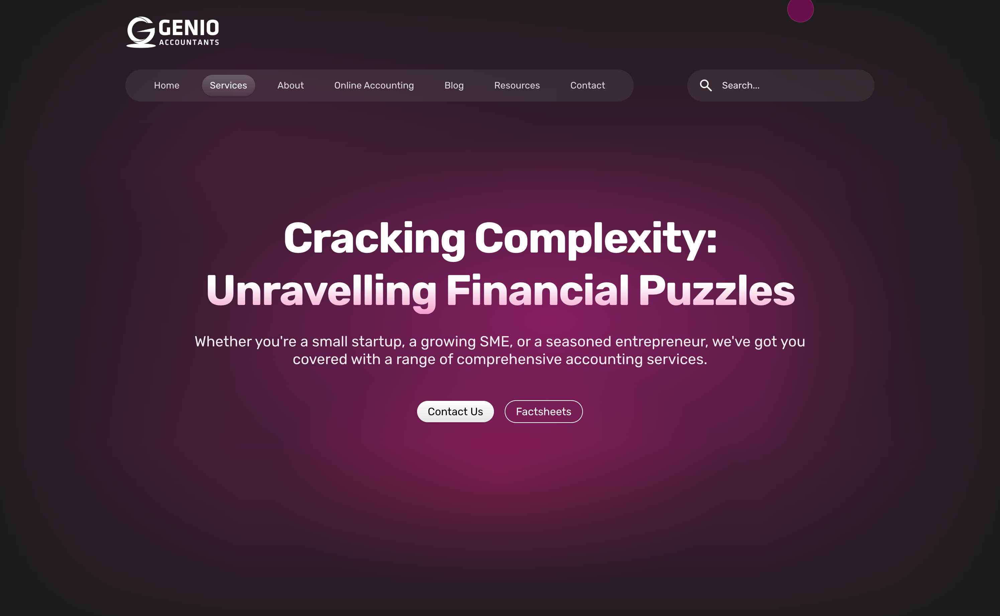
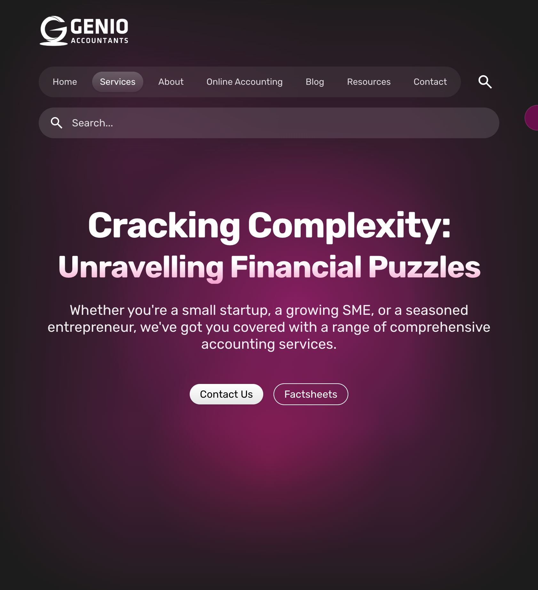
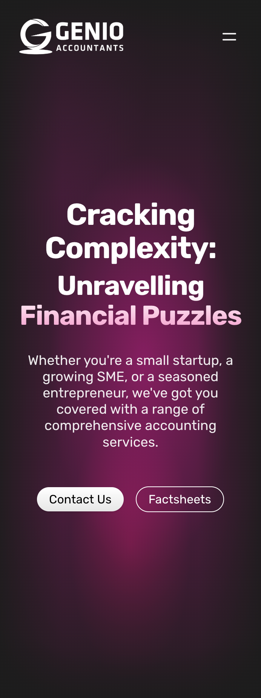

# Genio Accountants Landing Page

## Project Overview

Genio Accountants is a modern, fully responsive landing page for a professional accountancy firm. It prioritises performance, accessibility, and clean aesthetics, using a gradient-forward visual language and subtle motion for polish. Components are modular and reusable to keep the codebase maintainable as the site grows.

**Tech Stack**

* React.js
* Next.js (App Router)
* TailwindCSS (utility-first, custom CSS variables)
* Framer Motion (via `motion` package)
* TypeScript

---

## Live Demo & Previews

* **Live Demo:** [https://genio-project-nine.vercel.app/](https://genio-project-nine.vercel.app/)
* **Video Preview:**  
<div align="center">
    <iframe width="560" height="315" src="https://www.youtube.com/embed/7KRBJZb6S6s" title="Genio Landing Page Preview" frameborder="0" allowfullscreen></iframe>
  </div>

| Desktop                                    | Tablet                                   | Mobile                                   |
| ------------------------------------------ | ---------------------------------------- | ---------------------------------------- |
|  |  |  |

---

## Features

* Fully responsive across mobile, tablet, and desktop.
* Dark mode & light mode via CSS variables (theme toggled and persisted to `localStorage`).
* **GradientBorder** system for a consistent, brand-aligned ring effect.
* Subtle hover transitions on buttons, cards, and navigation links.
* Smooth **mobile search** expansion using Framer Motion.
* Fixed desktop navigation with visual treatment on scroll (backdrop/blur behaviour tied to `scrolled` state).
* Modular, reusable components for maintainability.
* Optimised testimonials: simplified, fade-based approach instead of a heavy infinite slider.

---

## Design Choices & Assumptions

* **Responsive-first layout:** Uses Tailwind breakpoints (`sm`, `md`, `lg`, `xl`) with proportional spacing—no hardcoded pixel widths for layout.
* **Reusable components:** `GradientBorder`, `ServiceCard`, `MobileNav`, `Header`, `Footer`, `NewsletterInput`, `ScrollToTop` keep patterns consistent.
* **Gradient-heavy visuals:** Standardised gradient tokens in `globals.css` for backgrounds, text, and borders.
* **Dark/Light theme support:** CSS variables swap seamlessly via `data-theme`; initial theme respects system preference.
* **Interactive visuals:** Framer Motion animates mobile search, fades, and cursor interactions (desktop-only custom cursor wrapper).
* **Accessibility-conscious:** Considered text contrast, focus outlines, and comfortable touch targets.
* **Clean typography hierarchy:** Responsive headings, gradient-emphasised headings, and clear CTAs.
* **Fixed navigation bar:** Desktop nav remains pinned; mobile nav and logo maintain independent fixed behaviour.
* **Button system unified:** Variants (`solid-white`, `solid-muted`, `outline-white`) with consistent hover transitions.
* **Testimonials simplified:** Dropped buggy infinite slider for a performant 3-card, fade-based design.

---

## Implementation Notes

* **Framer Motion**: Powers mobile search animation, testimonial fades, and custom cursor smoothing on desktop.
* **Custom utilities** (Tailwind + CSS):

  * `.bg-gradient` – layered hero background using CSS variables.
  * `.text-brand-gradient` – gradient text with `background-clip`.
  * `.gradient-ring` – reusable gradient border ring powered by `--border-gradient` and `--ring-size`.
  * `.bg-vignette` / `.edge-fade` – subtle depth and edge fading for hero/cards.
* **Global theme variables:** All colour tokens and gradient stops live in `src/app/globals.css` and map to Tailwind via `@theme inline`.
* **Header behaviour:** Tracks `scrolled` state on `window` scroll to enable blurred/backdrop variants.
* **Newsletter form:** Simple email validation with feedback states (`idle`, `loading`, `success`, `error`).

---

## Project Structure

```
/
├─ next.config.ts
├─ package.json
├─ postcss.config.mjs
├─ src/
│  └─ app/
│     ├─ globals.css                # Theme tokens, utilities, gradient + vignette helpers
│     ├─ layout.tsx                 # Root layout: fonts, header/footer, scroll-to-top, cursor
│     ├─ page.tsx                   # Home composition (Hero, Services, News, Tax Planning, Testimonials)
│     └─ components/
│        ├─ common/
│        │  ├─ custom-cursor.tsx
│        │  ├─ newsletter-input.tsx
│        │  └─ scroll-to-top.tsx
│        ├─ layout/
│        │  ├─ footer.tsx
│        │  ├─ header.tsx
│        │  └─ mobile-nav.tsx
│        ├─ sections/
│        │  └─ home/
│        │     ├─ hero.tsx
│        │     ├─ latest-news/
│        │     │  └─ news-list.tsx
│        │     ├─ services/
│        │     │  ├─ service-card.tsx
│        │     │  └─ services-hub.tsx
│        │     ├─ tax-planning.tsx
│        │     └─ testimonials/
│        │        └─ testimonial-slider.tsx
│        └─ ui/
│           ├─ button.tsx
│           └─ gradient-border.tsx
│
├─ src/lib/
│  └─ utils.ts                      # `cn()` – clsx + tailwind-merge
│
└─ public/
   └─ svgs/                         # Connector SVGs used in services section
```

---

## Getting Started

```bash
# 1) Clone
git clone <repo-url>
cd genio-project

# 2) Install dependencies
npm install

# 3) Run the dev server
npm run dev

# The app will be available at http://localhost:3000
```

> This project uses Next.js 15 with Turbopack (see `package.json` scripts). TailwindCSS v4 is configured via `@tailwindcss/postcss` and `postcss.config.mjs`.

---

## Service Card Connectors (Planned Enhancement)

The connectors between the service cards and the central hub were removed in this version.

I initially attempted to make them **fully dynamic** — starting from the **exact vertical center** of each card, scaling responsively, and curving into the hub.  
However, achieving perfect alignment across **all breakpoints** proved tricky due to SVG scaling and aspect ratio constraints.

**Future Plan:**  
- Either make them **static** (pixel-perfect SVGs per breakpoint), or  
- Implement a **dynamic Bézier path** solution that calculates exact positions at runtime.

This keeps the layout clean for now, but the feature can be added back later without changing any existing structure.

## Light Mode Asset Support
While the layout supports **light/dark themes** via CSS variables, some assets aren't optimized yet:  

- Certain **SVG icons** (e.g., the right arrow, the logos too) are designed for **dark backgrounds** and become invisible on light mode.
- Some **hero and decorative images** lack light-mode variations.
- Since alternate assets are not yet available, **light mode looks incomplete** visually.

**Future Plan:**  
- Add **light-mode variants** for images, icons, and connector SVGs.
- Use **theme-aware asset swapping** via Next.js dynamic imports.

---

## Future Improvements

* Add automated accessibility testing (e.g., Lighthouse CI, axe) and performance audits.
* Improve API integration and Supabase hooks for dynamic content.
* Enhance content management for “Latest News” via headless CMS or MDX.
* Adapt the design for React Native:
   * **Reuse the overall design ideas** but rebuild the layout using **React Native components** like `View`, `Text`, and `Image`.
   * Use a **simple styling solution** such as **NativeWind** *(Tailwind-like classes)* or **StyleSheet** to maintain a consistent look.
   * Replace web-based gradients with **react-native-linear-gradient** for the same visual style.
   * Use **Reanimated** or **Moti** to recreate smooth **animations**, fades, and transitions.
   * Swap the navigation bar for **React Navigation** to handle **stacked pages** and **bottom tabs**.
   * Ensure layouts are **fully responsive** across screen sizes using **flexbox**, `Dimensions`, and breakpoint helpers.
   * **Optimise images and SVGs** for better **mobile performance** while keeping the same overall visual feel.